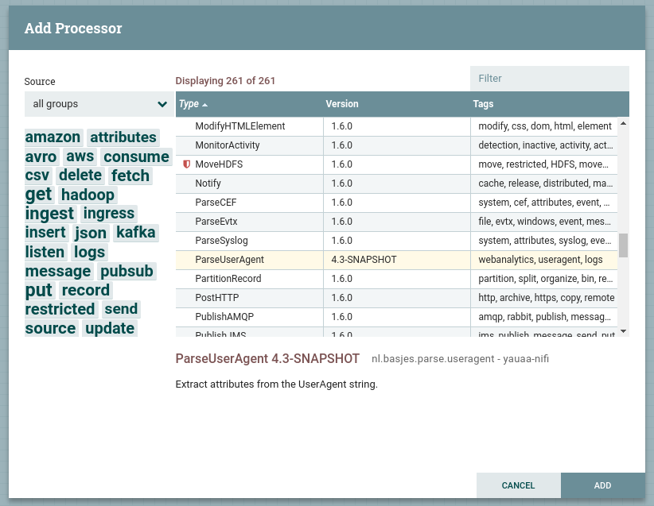

# User Defined Function for Apache Nifi

## Introduction
This is an Apache Nifi Processor for parsing User Agent Strings.

## Getting the Processor

You can get the prebuilt NAR file from [maven central](https://search.maven.org/remotecontent?filepath=nl/basjes/parse/useragent/yauaa-nifi/{{ book.YauaaVersion }}/yauaa-nifi-{{ book.YauaaVersion }}.nar).

If you use a maven based project simply add this dependency

<pre><code>&lt;dependency&gt;
  &lt;groupId&gt;nl.basjes.parse.useragent&lt;/groupId&gt;
  &lt;artifactId&gt;yauaa-nifi&lt;/artifactId&gt;
  &lt;type&gt;nar&lt;/type&gt;
  &lt;version&gt;{{ book.YauaaVersion }}&lt;/version&gt;
&lt;/dependency&gt;
</code></pre>

## Installation
To install this function put the nar file in the <nifi-path>/lib directory.

    cp ./udfs/nifi/nifi-nar/target/yauaa-nifi-<version>.nar <nifi-path>/lib

Make sure you replace `<nifi-path>` with your actual path to your nifi installation.
After you have added this nar file you will find the ParseUserAgent processor in the list.

# Usage and examples

1. First you make sure that the FLowFile going into this processor has the attribute "UseragentString" that contains the string to be analyzed.

2. In the configuration enable the fields you need for analysis. By default none have been selected.
   

3. The output FlowFile will now have additional attributes for all of the selected attributes that are named
   Useragent.SelectedField.
   
       Key: 'Useragent.DeviceClass'
               Value: 'Phone'
       Key: 'Useragent.OperatingSystemNameVersion'
               Value: 'Android 4.1.2'

